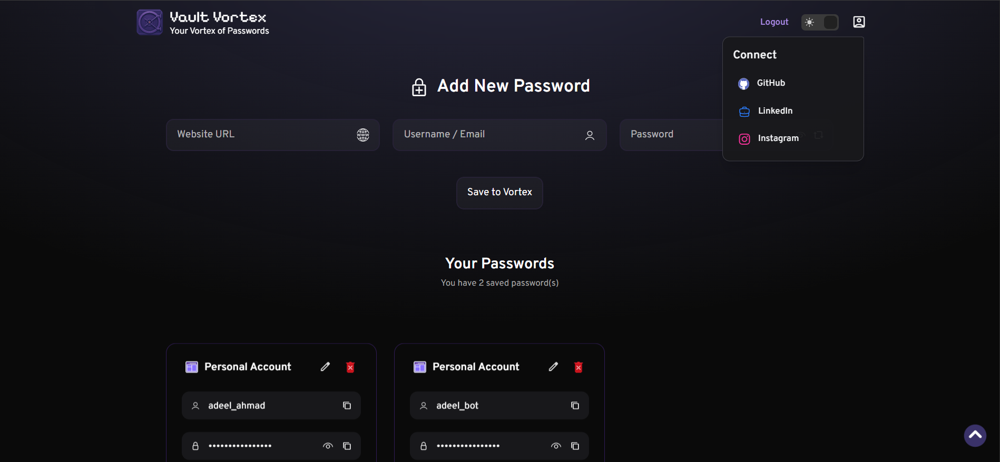
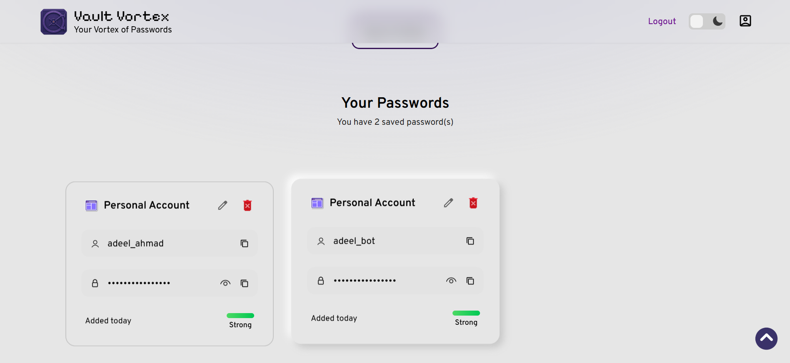
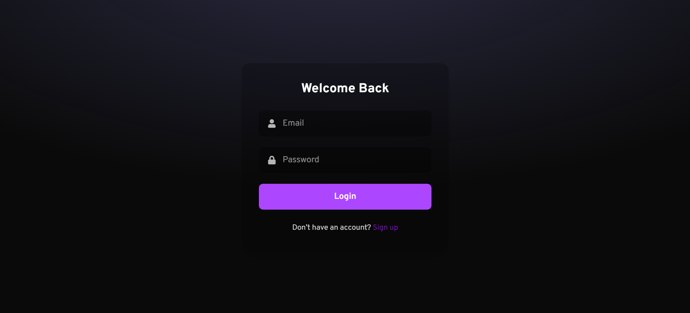
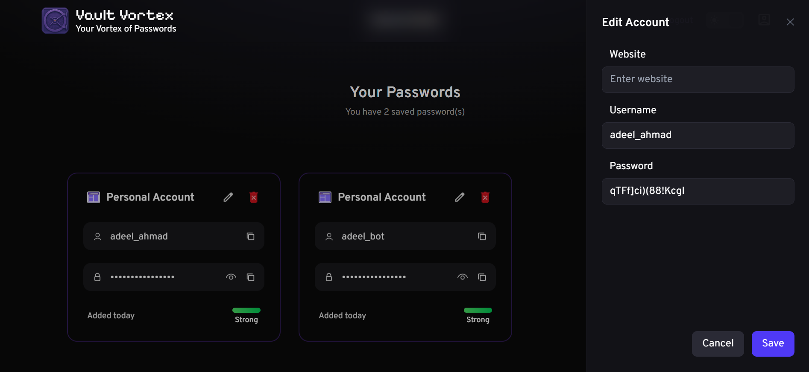

# 🔐🌪️ VaultVortex


VaultVortex is a secure password management web app that lets users store, manage, and organize credentials safely in one place.
Built with the MERN stack, it focuses on authentication, encryption, and seamless user experience for password storage.


> ✨ Try the live demo: [vault-vortex](https://vault-vortex.vercel.app/login)

---

## 🖼️ Features

- 🔑 **User Authentication (JWT + Cookies)**
- 🔒 **Encrypted password storage with Mongoose** 
- 📝  **Add, view, edit, and delete credentials**
- 👤  **User-specific vaults (data isolated per account)**
- 🚪  **Secure logout with cookie/session handling**
- 🌗  **Dark/Light theme support**
- 📱 **Fully responsive design**
- 🖱️ **Custom UI cursor and hover effects**

---

## 🚀 Tech Stack
## Frontend
- ⚛️ **React.js**
- 🎨 **TailwindCSS**
- 💫 **Framer Motion**
- ⚡ **Axios (API requests)**
- 🧭 **React Router**
- 💾 **LocalStorage (to remember theme)**

## Backend
- 🟢 **Node.js**
- 🚂 **Express.js**
- 🍃 **MongoDB + Mongoose**
- 🔐 **Crypto (password encryption)**
- 🛡️ **JWT Authentication**

## Deployment
- ▲ **Vercel [Frontend + Backend]**


## 📷 Screenshots

| Home Page | Home-light Page | Login Page | Edit Section |
|-----------|-----------------|-----------|-----------------|

|  |  |  |  |

---

## 📂 Project Structure

```
VaultVortex/
|
├── client/                # React frontend
│   |
│   ├── src/
│   │   ├── components/
│   │   ├── pages/
│   │   ├── services/
│   │   ├── utils/
│   │   ├── App.jsx
│   │   └── main.jsx
│   └── package.json
│   
├── server/                # Node/Express backend
│   ├── models/
│   ├── routes/
│   ├── index.js
│   └── package.json
│   
├── Screenshots/     
└── README.md

```

---

## 🛠️ Getting Started

To run this project locally:

```bash
# Clone the repo
git clone https://github.com/adeel-bot/VaultVortex.git

cd VaultVortex
# make changes to the links to backend + frontend + database

# Run backend
cd server
npm install
node index.js

# Run frontend
cd ../client
npm install
npm run dev


```

## 📦 Deployment
- Frontend deployed on **Vercel**
- Backend deployed on **Vercel**
- Environment variables (.env) are required for JWT secrets, encryption keys, and DB connection.


## ⚠️ Security Note
VaultVortex was built as a **learning project** to explore authentication, encryption, and MERN stack development.
It is **not intended for production use** as a real-world password manager. For actual secure password storage, always use trusted solutions.

## 📜 License
This project is licensed under the MIT License.

## 🙋‍♂️ Author
Made with ❤️ by [Adeel Ahmad](https://www.linkedin.com/in/adeel-bot)  
Follow me on [Instagram](https://www.instagram.com/adeel_bot)
